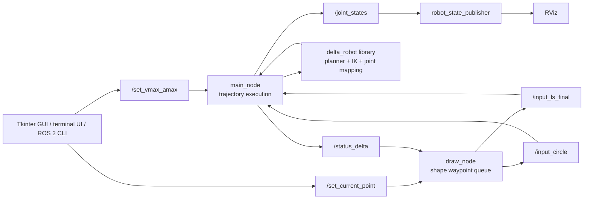

# Project Overview: ROS 2 Delta Robot

_Last reviewed and verified: 2026-07-18_

## Executive Summary

`my_delta_robot` is a ROS 2 package for simulating and visualizing a three-arm delta parallel robot. Its current active workflow accepts a rectangle, triangle, circle, or direct Cartesian line command; generates a time-sampled straight-line trajectory; validates inverse kinematics (IK) for the entire path; and publishes a 12-joint state for `robot_state_publisher` and RViz.

The project is currently strongest as a motion-planning and visualization prototype. It has a working ROS 2 command path, a reusable C++ kinematics/trajectory library, a Tkinter GUI, a terminal UI, a URDF/RViz setup, custom messages, and unit tests. Camera processing and physical motor communication exist only as legacy or experimental source files and are not part of the active build or launch path.

## Current Project Status

| Area | Status | Notes |
|---|---|---|
| ROS 2 package | Active | Package name: `my_delta_robot`; package version is still `0.0.0`. |
| Motion planning | Active | Straight Cartesian segments use triangular or trapezoidal profiles sampled at 1 kHz and executed against steady-clock elapsed time. |
| Inverse kinematics | Active | Every planned sample is checked before motion begins and checked again during execution. |
| Shape drawing | Active | Rectangle and triangle use sequential lines; circles use one continuous 1 kHz parametric trajectory. |
| Visualization | Active | URDF, TF, `/joint_states`, and RViz are started by `display.launch.py`. |
| User interfaces | Active | Tkinter GUI and terminal UI publish the same motion-limit and shape topics. |
| Automated tests | Passing | One GoogleTest target covers IK, joint mapping, planner profiles and guards, command validation, and shape closure. |
| Latest verification | Passing | On 2026-07-18 the package built successfully and `colcon test-result --verbose` reported 13 tests with 0 errors, failures, or skips. |
| Camera/image flow | Legacy | Several scripts use ROS 1 `rospy`; they are not installed or launched by the ROS 2 package. |
| Serial/hardware control | Experimental | `serial_module.cpp` is present but is not compiled or launched. |

Repository snapshot at review time:

- Git branch: `branch_ros2`
- Latest commit: `181e121` (`2026-05-29`, “add detail about architecture of software”)
- Active build products: `main_node`, `draw_node`, and three installed Python scripts
- Main documentation: `README.md` and `docs/software_architecture.md`

## System Architecture



The shape flow is sequential. `draw_node` sends one line segment, waits for `main_node` to publish `DONE`, updates its current point, and then sends the next queued segment. A `FAILED:` status clears the queue without advancing the assumed current point. New drawing commands are rejected while a sequence is active.

## Main Components

| Component | Location | Responsibility |
|---|---|---|
| `main_node` | `src/src/main_node.cpp` | Validates line/circle commands, plans and pre-validates trajectories, selects samples from steady-clock elapsed time, and publishes joint states, profile values, and success/failure status. |
| `draw_node` | `src/src/draw_node.cpp` | Runs a guarded drawing state machine backed by `std::deque`; circle execution is a distinct continuous-motion state between approach and return lines. |
| Delta robot library | `src/delta_robot/` | Implements inverse kinematics, Cartesian line profiles, motion-limit conversion, and the 12-joint RViz mapping. |
| Command validation | `src/delta_robot/command_validation.hpp` | Rejects non-finite coordinates and non-positive/non-finite motion limits for every command source. |
| Shape path generation | `src/delta_robot/shape_path.hpp` | Pure helpers generate closed rectangle, triangle, and circle paths for reuse and unit testing. |
| GUI | `src/python_scripts/gui_user_interface_node.py` | Validates velocity/acceleration input and sends a selected drawing command using Tkinter. |
| Terminal UI | `src/python_scripts/user_interface_node.py` | Provides the same command workflow in a terminal. |
| Launch and visualization | `src/launch/`, `src/urdf/`, `src/rviz/` | Starts the model, TF publisher, runtime nodes, and RViz configuration. |
| Custom interfaces | `src/msg/` | Defines seven project-specific message types. |
| Tests | `src/test/test_delta_robot.cpp` | Exercises core kinematics, joint mapping, and trajectory behavior. |

## Runtime Nodes and Topics

| Topic | Message type | Publisher | Subscriber | Purpose |
|---|---|---|---|---|
| `/set_vmax_amax` | `VmaxAmax` | GUI, terminal UI, or CLI | `main_node` | Sets maximum Cartesian velocity and acceleration. |
| `/set_current_point` | `Posicionxyz` | GUI, terminal UI, or CLI | `draw_node` | Updates draw configuration or requests a shape. |
| `/input_ls_final` | `LinearSpeedXYZ` | `draw_node` or CLI | `main_node` | Commands one Cartesian line segment in millimetres. |
| `/input_circle` | `CircleXYZ` | `draw_node` or custom node | `main_node` | Commands one full continuous circle using center, Z plane, radius, and direction. |
| `/set_num_point` | `NumPoint` | CLI/custom node | `main_node` | Sets the legacy offline resolution; it does not change the active 1 kHz runtime sampling. |
| `/joint_states` | `sensor_msgs/JointState` | `main_node` | `robot_state_publisher`/RViz | Publishes the robot's 12 modeled joints. |
| `/v_a_out` | `VmaxAmax` | `main_node` | Optional observers | Reports each sample's path velocity and acceleration. |
| `/status_delta` | `std_msgs/String` | `main_node` | `draw_node` | Reports `DONE ...` on completion or `FAILED: ...` on a rejected/aborted segment. |
| `/send_to_node_b` | `Posicionxyz` | Legacy/custom source | `draw_node` | Retained compatibility input for the older image pipeline. |
| `/status_to_node_a` | `std_msgs/String` | `draw_node` | Legacy `node_a` | Retained completion signal for the older image pipeline. |

Shape request codes on `/set_current_point` are `6` for rectangle, `7` for triangle, and `8` for circle. Codes `-1` through `5` alter the current point, three stored path points, or Z offsets; see `README.md` and `draw_node.cpp` before using these lower-level configuration commands.

## Motion and Coordinate Conventions

- Public Cartesian commands use millimetres; the planner and IK core use metres.
- The TCP home pose is `(0, 0, -375 mm)` in `base_link`.
- Negative Z points downward into the robot workspace.
- Runtime defaults are `5000 mm/s` maximum velocity and `100 mm/s²` maximum acceleration.
- The planner automatically uses a triangular profile for short moves and a trapezoidal profile when the path is long enough to reach the requested maximum velocity.
- Each planned point must pass IK validation before the segment starts, preventing partial execution of a known-invalid path.
- The 1 ms timer uses steady-clock elapsed time to select the correct planned sample, so callback jitter no longer stretches motion by blindly advancing one sample per callback.
- The planner rejects non-finite input and trajectories requiring more than 1,000,000 samples.
- Circle closure reuses the exact first waypoint, avoiding a near-zero floating-point closing segment.
- Active circle drawing is parametric rather than a polygon: path velocity stays tangential, acceleration includes the radial centripetal term, curvature limits circle speed to the configured acceleration envelope, and the robot only stops at the beginning/end of the revolution.

## Build, Run, and Test

From the repository root:

```bash
./build.zsh
source install/setup.zsh
ros2 launch my_delta_robot display.launch.py
```

Run the GUI in another sourced terminal:

```bash
ros2 run my_delta_robot gui_user_interface_node.py
```

Run the automated tests:

```bash
colcon test --packages-select my_delta_robot
colcon test-result --verbose
```

The documented target environment is ROS 2 Humble or a compatible ROS 2 distribution. The package uses `ament_cmake`, C++ ROS nodes, Python ROS nodes, custom ROSIDL interfaces, `robot_state_publisher`, TF, and RViz.

## Repository Layout

```text
ROS2/
├── README.md                         # Setup, usage, and topic commands
├── PROJECT_OVERVIEW.md               # This project-level summary
├── docs/software_architecture.md     # Detailed Mermaid architecture and sequences
├── build.zsh                         # Convenience colcon build script
└── src/                              # ROS 2 package: my_delta_robot
    ├── CMakeLists.txt
    ├── package.xml
    ├── delta_robot/                  # C++ kinematics and trajectory library
    │   ├── command_validation.hpp    # Shared command guards
    │   └── shape_path.hpp            # Pure drawing path generators
    ├── src/                          # C++ ROS nodes plus inactive legacy sources
    ├── python_scripts/               # Active UIs plus inactive camera experiments
    ├── msg/                          # Seven custom messages
    ├── launch/                       # Display and initial-pose launch files
    ├── urdf/                         # Robot model
    ├── rviz/                         # RViz configuration
    ├── test/                         # GoogleTest suite
    └── images/                       # Camera/image-processing sample assets
```

## Known Gaps and Risks

1. **No active hardware output:** the main runtime stops at `/joint_states`; it does not generate step pulses or send commands to a motor controller.
2. **Legacy code is mixed into the package tree:** camera scripts use ROS 1 APIs, and `node_a.cpp`, `node_b.cpp`, `serial_module.cpp`, and other experimental C++ files are not built by the current CMake configuration. This can make active versus historical functionality unclear.
3. **Limited integration coverage:** core math, guards, and shape generation have tests, but live node topic behavior, launch startup, GUI behavior, and URDF/TF consistency are not tested automatically.
4. **Status remains string-based:** success/failure handling is now explicit, but `/status_delta` still uses human-readable strings rather than a typed service or action result.
5. **No cancel or pause protocol:** the GUI reset only clears form fields. There is no ROS service/action for canceling or pausing active motion.
6. **Single-command execution:** active motion and drawing sequences reject new commands instead of buffering them. Shape sequencing still depends on the `/status_delta` handshake.
7. **Prototype metadata:** the package version remains `0.0.0`, and the package manifest does not communicate a release maturity level.

## Recommended Next Steps

1. Add node-level integration tests for valid motion, unreachable paths, busy-command rejection, failure cleanup, and multi-segment shape completion.
2. Replace the string topic handshake with a ROS 2 action for typed results, goal feedback, cancellation, timeout, and failure handling.
3. Move ROS 1 camera and inactive C++ sources into a clearly named `legacy/` or separate package, or port them fully to ROS 2.
4. Define the hardware architecture: motor controller, homing, joint limits, emergency stop, timing, and feedback before enabling physical motion.
5. Add CI for build, test, lint, and optionally URDF validation; then assign a meaningful package version.

## Documentation Guide

- Start with `README.md` for build and usage commands.
- Use this file for project scope, current status, and priorities.
- Use `docs/software_architecture.md` for detailed component, topic, and sequence diagrams.
