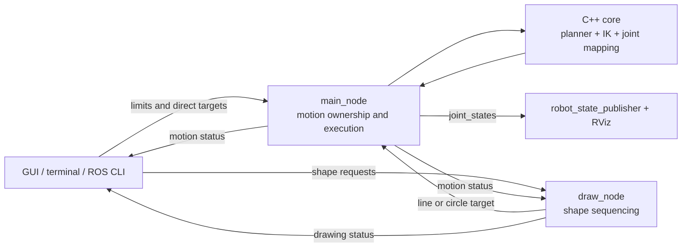

# Project Overview

## Purpose

`my_delta_robot` is a ROS 2 motion-planning and visualization prototype for a
three-arm delta robot. The supported workflow accepts shape or Cartesian
commands, plans time-parameterized motion, validates every sample with inverse
kinematics, and publishes a 12-joint model for RViz and operator feedback.

It is intentionally a simulation package today. Hardware timing, homing,
feedback, safety interlocks, and emergency-stop behavior are outside the active
runtime.

## Current capabilities

| Area | State |
|---|---|
| Cartesian line planning | Active; triangular or trapezoidal profiles |
| Continuous circle planning | Active; tangent motion with curvature-aware acceleration |
| Inverse kinematics | Active; complete trajectories are preflighted |
| Shape sequencing | Active; rectangle, triangle, and circle |
| Visualization | Active; URDF, TF, joint states, and RViz |
| Operator interfaces | Active; Tkinter panel and terminal menu |
| Core automated tests | Active; kinematics, mapping, planners, guards, and paths |
| Camera/image processing | Archived ROS 1 experiments |
| Serial/motor output | Archived experiment; no supported hardware control |

## Component boundaries

The core uses metres and seconds. ROS-facing Cartesian command messages use
millimetres. `main_node` owns the authoritative current TCP, so a stale
caller-provided start cannot create a discontinuity in the published model.

## Repository policy

Only code wired into CMake, installed, launched, and tested belongs in the
active package directories. Historical ROS 1 camera, tutorial, old drawing,
serial, and redundant initial-pose files live under `src/legacy/` with their
legacy-only interfaces.

The canonical entry point is `bringup.launch.py`. `control.launch.py` and
`display.launch.py` remain thin compatibility launchers.

## Main risks

1. Motion completion uses uncorrelated string topics. A ROS 2 action would add
   typed acceptance, feedback, goal IDs, cancellation, and multi-client safety.
2. There is no supported physical-controller boundary or safety architecture.
3. Runtime integration, launch, GUI, and URDF/TF behavior need broader
   automated coverage.
4. Shape dimensions and locations are mostly source-configured rather than ROS
   parameters or typed command fields.

## Recommended roadmap

1. Replace line/circle status strings with a ROS 2 action and migrate drawing
   sequencing to action goals.
2. Add node-level and launch tests for acceptance, busy rejection, unreachable
   targets, failure cleanup, and complete multi-segment drawings.
3. Define hardware responsibilities: homing, joint limits, feedback, step
   scheduling, watchdogs, and emergency stop.
4. Expose validated shape geometry and workspace limits as ROS parameters or
   typed goals.
5. Add continuous integration for a clean build/install, tests, manifest
   validation, formatting, and URDF checks.

Start with [README.md](README.md) for setup and commands, then use
[docs/software_architecture.md](docs/software_architecture.md) for runtime
details.
