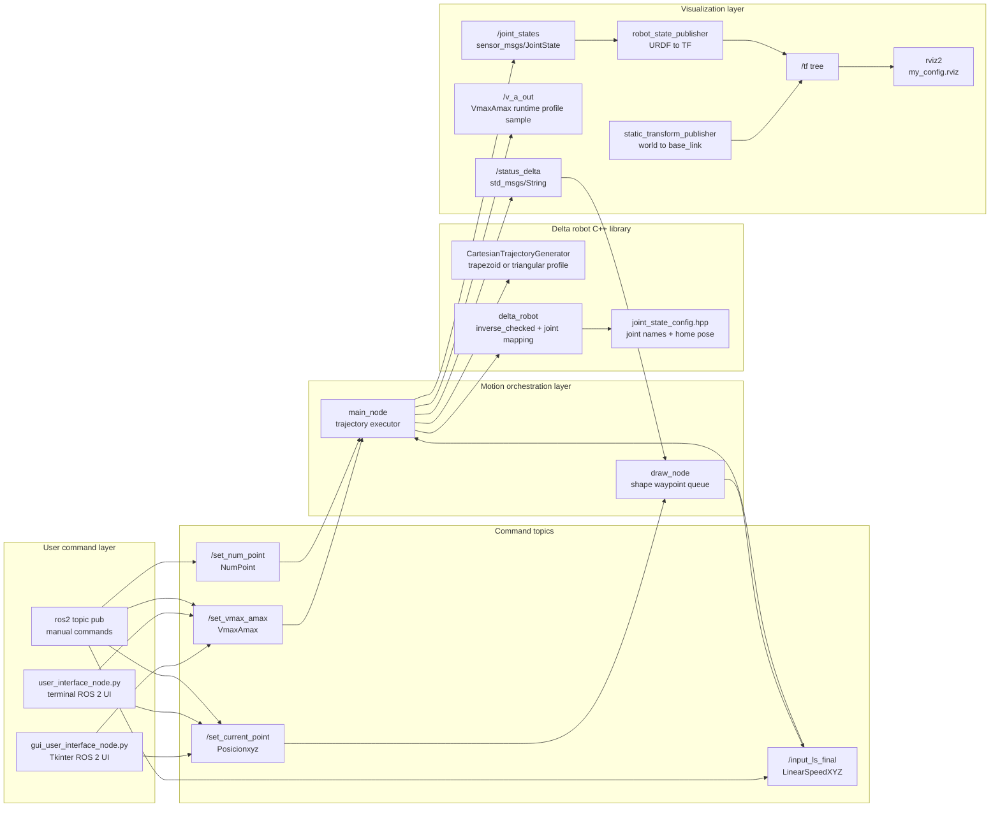
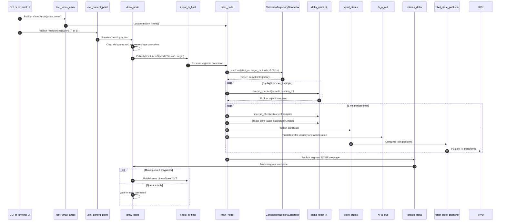
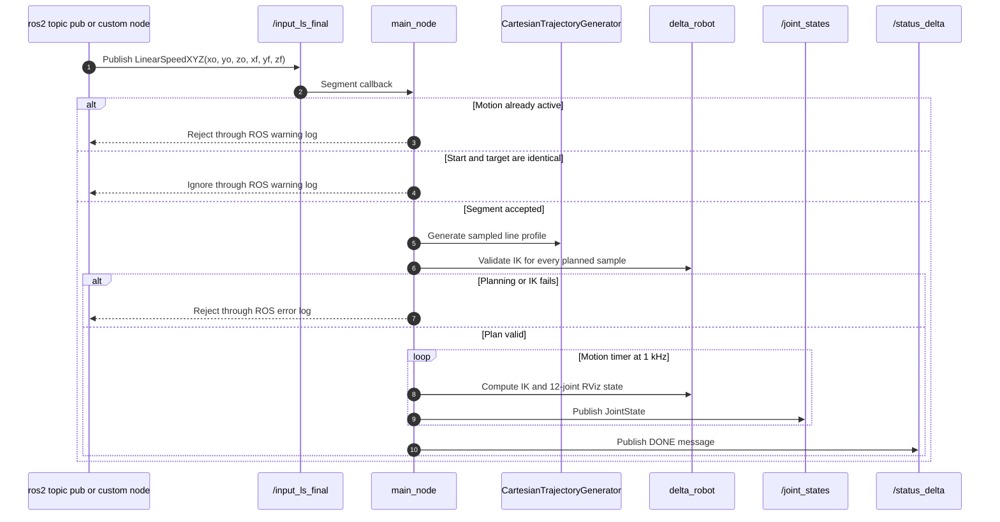
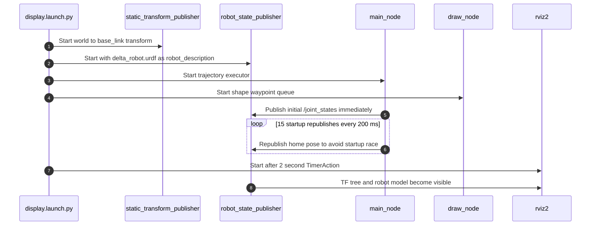
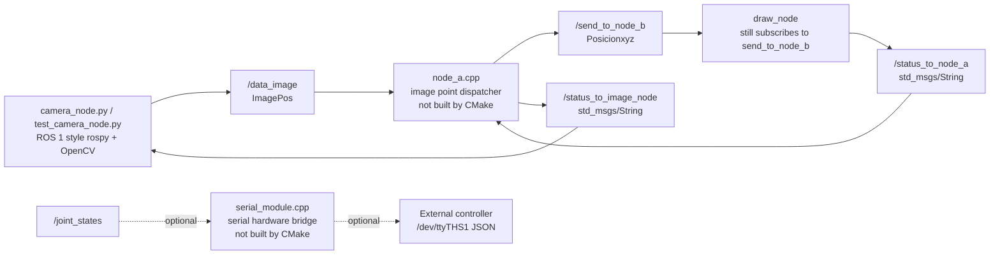

# Software Architecture

This document illustrates the ROS 2 software architecture for `my_delta_robot`.
The active runtime path is the one launched by `display.launch.py`; older camera
and image-processing files are documented separately as optional or legacy flows.

## Active Runtime Architecture

## Runtime Responsibilities

| Component | Source | Responsibility |
|-----------|--------|----------------|
| `display.launch.py` | `src/launch/display.launch.py` | Starts `world_to_base_link`, `robot_state_publisher`, `main_node`, `draw_node`, then RViz after a short delay. |
| `gui_user_interface_node.py` | `src/python_scripts/gui_user_interface_node.py` | Publishes motion limits and a shape action from a Tkinter UI. |
| `user_interface_node.py` | `src/python_scripts/user_interface_node.py` | Legacy terminal UI that publishes the same active command topics. |
| `draw_node` | `src/src/draw_node.cpp` | Converts shape commands into ordered Cartesian waypoints and sends one segment at a time. |
| `main_node` | `src/src/main_node.cpp` | Accepts line segments, plans sampled Cartesian motion, validates IK, publishes joint states and completion status. |
| `delta_robot` library | `src/delta_robot/` | Provides inverse kinematics, motion limits, trapezoidal trajectory utilities, and RViz joint mapping. |
| `robot_state_publisher` | ROS 2 runtime | Converts `/joint_states` plus `delta_robot.urdf` into TF transforms for RViz. |

## Shape Command Sequence

## Direct Segment Sequence

## Launch And Visualization Startup

## Optional Legacy Camera And Hardware Flow

These files are present in the repository but are not part of the active
`display.launch.py` build/run path.

## Topic Map

| Topic | Message | Publisher | Subscriber | Notes |
|-------|---------|-----------|------------|-------|
| `/set_vmax_amax` | `VmaxAmax` | GUI, terminal UI, CLI | `main_node` | Sets max velocity and acceleration in mm units at the command interface. |
| `/set_current_point` | `Posicionxyz` | GUI, terminal UI, CLI | `draw_node` | Type `6`, `7`, `8` request rectangle, triangle, circle. Types `-1` through `5` update draw-node reference state. |
| `/input_ls_final` | `LinearSpeedXYZ` | `draw_node`, CLI/custom nodes | `main_node` | One Cartesian line segment from start to target. |
| `/set_num_point` | `NumPoint` | CLI/custom nodes | `main_node` | Updates the legacy offline resolution value; runtime planner samples at 1 kHz. |
| `/joint_states` | `sensor_msgs/JointState` | `main_node` | `robot_state_publisher`, RViz, optional serial bridge | Contains 12 published joints matching `joint_state_config.hpp` and the URDF. |
| `/status_delta` | `std_msgs/String` | `main_node` | `draw_node` | Segment-complete handshake for queued waypoints. |
| `/v_a_out` | `VmaxAmax` | `main_node` | optional observers | Publishes current path velocity and acceleration sample values. |
| `/send_to_node_b` | `Posicionxyz` | legacy `node_a` or custom nodes | `draw_node` | Supported by `draw_node`, but active CMake does not build `node_a`. |
| `/status_to_node_a` | `std_msgs/String` | `draw_node` | legacy `node_a` | Used only by the legacy image-pipeline handshake. |
