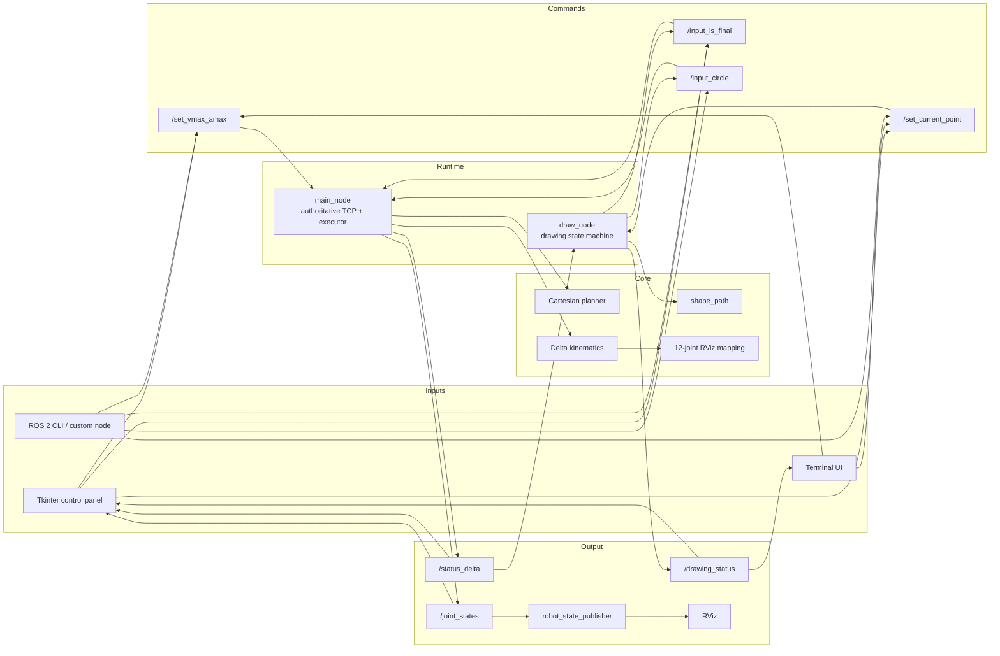
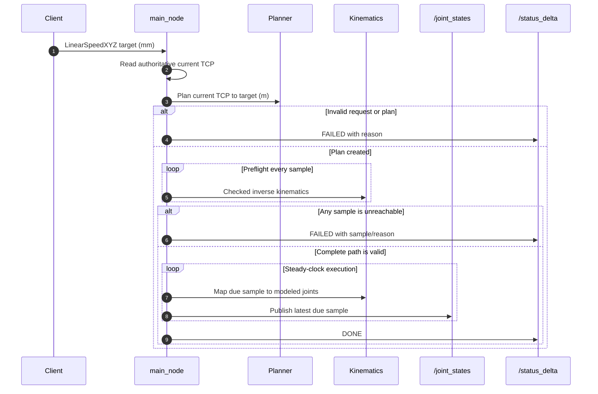
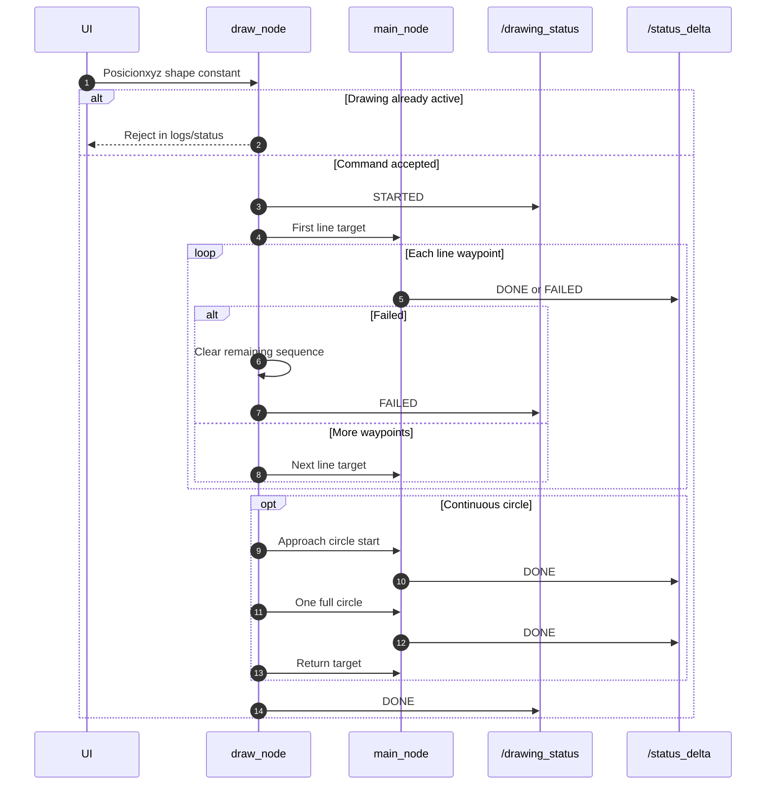
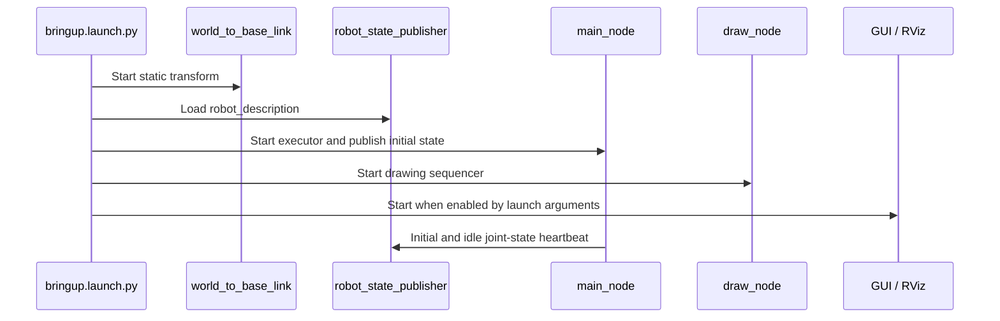

# Software Architecture

## Runtime topology

`bringup.launch.py` is the canonical launcher. It always starts the motion
runtime and robot model; `gui` and `rviz` launch arguments control optional
operator processes.

```mermaid
flowchart LR
    subgraph Inputs
        GUI["Tkinter control panel"]
        TUI["Terminal UI"]
        CLI["ROS 2 CLI / custom node"]
    end

    subgraph Commands
        LIMITS["/set_vmax_amax"]
        SHAPE["/set_current_point"]
        LINE["/input_ls_final"]
        CIRCLE["/input_circle"]
    end

    subgraph Runtime
        DRAW["draw_node<br/>drawing state machine"]
        MAIN["main_node<br/>authoritative TCP + executor"]
    end

    subgraph Core
        PATHS["shape_path"]
        PLANNER["Cartesian planner"]
        IK["Delta kinematics"]
        MAPPING["12-joint RViz mapping"]
    end

    subgraph Output
        JOINTS["/joint_states"]
        MOTION_STATUS["/status_delta"]
        DRAW_STATUS["/drawing_status"]
        RSP["robot_state_publisher"]
        RVIZ["RViz"]
    end

    GUI --> LIMITS
    GUI --> SHAPE
    GUI --> LINE
    TUI --> LIMITS
    TUI --> SHAPE
    CLI --> LIMITS
    CLI --> SHAPE
    CLI --> LINE
    CLI --> CIRCLE

    SHAPE --> DRAW
    DRAW --> PATHS
    DRAW --> LINE
    DRAW --> CIRCLE
    LIMITS --> MAIN
    LINE --> MAIN
    CIRCLE --> MAIN
    MAIN --> PLANNER
    MAIN --> IK
    IK --> MAPPING
    MAIN --> JOINTS
    MAIN --> MOTION_STATUS
    MOTION_STATUS --> DRAW
    MOTION_STATUS --> GUI
    DRAW --> DRAW_STATUS
    DRAW_STATUS --> GUI
    DRAW_STATUS --> TUI
    JOINTS --> GUI
    JOINTS --> RSP
    RSP --> RVIZ
```

## Responsibilities

| Component | Responsibility |
|---|---|
| `bringup.launch.py` | Start the model, motion nodes, and optional UI/RViz processes |
| `main_node` | Own current TCP state, validate commands, plan and preflight trajectories, publish samples and motion status |
| `draw_node` | Convert shape requests into a guarded sequence of line/circle commands |
| trajectory planner | Generate bounded, time-stamped line and circle samples |
| kinematics model | Compute checked inverse kinematics and mapped joint positions |
| GUI | Validate operator input, publish commands, and display live state/status |
| terminal UI | Publish one drawing command at a time and wait for truthful completion feedback |
| `robot_state_publisher` | Convert `/joint_states` and the URDF into TF |

## Units and ownership

- ROS Cartesian commands use millimetres.
- Motion-limit commands use millimetres per second and millimetres per second
  squared.
- The planner and inverse-kinematics core use metres and SI-derived units.
- `main_node` is the authority for the current TCP. The start fields in
  `LinearSpeedXYZ` remain for compatibility and diagnostics, but do not control
  the actual start of a new trajectory.
- The home TCP is `(0, 0, -375 mm)` in `base_link`.

Keeping state ownership in `main_node` prevents a delayed UI sample or arbitrary
caller start from teleporting `/joint_states`.

## Direct-line execution

```mermaid
sequenceDiagram
    autonumber
    participant Client
    participant Main as main_node
    participant Planner
    participant IK as Kinematics
    participant State as /joint_states
    participant Status as /status_delta

    Client->>Main: LinearSpeedXYZ target (mm)
    Main->>Main: Read authoritative current TCP
    Main->>Planner: Plan current TCP to target (m)
    alt Invalid request or plan
        Main->>Status: FAILED with reason
    else Plan created
        loop Preflight every sample
            Main->>IK: Checked inverse kinematics
        end
        alt Any sample is unreachable
            Main->>Status: FAILED with sample/reason
        else Complete path is valid
            loop Steady-clock execution
                Main->>IK: Map due sample to modeled joints
                Main->>State: Publish latest due sample
            end
            Main->>Status: DONE
        end
    end
```

Trajectory samples are planned at 1 ms intervals. The timer selects samples
from steady-clock elapsed time, so callback jitter does not stretch a motion by
advancing exactly one sample per callback.

## Shape execution

```mermaid
sequenceDiagram
    autonumber
    participant UI
    participant Draw as draw_node
    participant Main as main_node
    participant DrawStatus as /drawing_status
    participant MotionStatus as /status_delta

    UI->>Draw: Posicionxyz shape constant
    alt Drawing already active
        Draw-->>UI: Reject in logs/status
    else Command accepted
        Draw->>DrawStatus: STARTED
        Draw->>Main: First line target
        loop Each line waypoint
            Main->>MotionStatus: DONE or FAILED
            alt Failed
                Draw->>Draw: Clear remaining sequence
                Draw->>DrawStatus: FAILED
            else More waypoints
                Draw->>Main: Next line target
            end
        end
        opt Continuous circle
            Draw->>Main: Approach circle start
            Main->>MotionStatus: DONE
            Draw->>Main: One full circle
            Main->>MotionStatus: DONE
            Draw->>Main: Return target
        end
        Draw->>DrawStatus: DONE
    end
```

Rectangle and triangle paths close exactly before returning to the prior point.
A circle is one parametric revolution rather than a polygon, so the robot does
not stop at intermediate vertices.

## Startup

```mermaid
sequenceDiagram
    participant Launch as bringup.launch.py
    participant StaticTF as world_to_base_link
    participant RSP as robot_state_publisher
    participant Main as main_node
    participant Draw as draw_node
    participant Optional as GUI / RViz

    Launch->>StaticTF: Start static transform
    Launch->>RSP: Load robot_description
    Launch->>Main: Start executor and publish initial state
    Launch->>Draw: Start drawing sequencer
    Launch->>Optional: Start when enabled by launch arguments
    Main->>RSP: Initial and idle joint-state heartbeat
```

RViz may start immediately; the idle joint-state heartbeat and normal TF
discovery handle startup ordering without a hard-coded delay.

## Current protocol limitation

`/status_delta` and `/drawing_status` are human-readable strings. They are
adequate for the current single-command simulation UI, but they have no goal
identifier, typed result, cancellation, or robust multi-client arbitration.
The preferred next architecture is a ROS 2 action owned by `main_node`, with
`draw_node` acting as an action client for multi-stage shapes.

Unsupported ROS 1 camera and hardware experiments are isolated under
[`src/legacy/`](../src/legacy/README.md) and are not part of this architecture.
